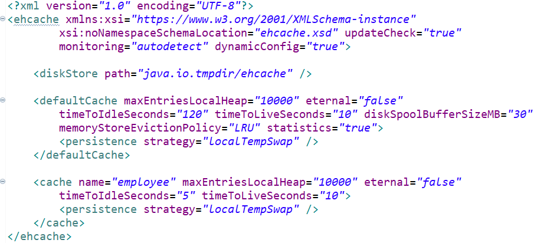

# ORM, JPA, Hibernate and Spring 

 > Take-home tasks
 
 1. Set the employee cache to 20 seconds, and run the test again.  Look at testCache.  What happens?  Document your findings.
 <b>Answer 1:</b> 
 
 
 
 The configurations for Ehcache are:  
-  DiskStore: EHCache stores data into memory but when it starts overflowing, 
it starts writing data into the file system. We use this property to define 
the location where EHCache will write the overflown data.

- defaultCache: It’s a mandatory configuration, it is used when an Object 
need to be cached and there are no caching regions defined for that.  For example, timeToLiveSeconds was set to 10, meaning that things will be kept in cache for 10 seconds.

- cache name=”employee”: We can cache element to define the region (e.g.,
@Cache(usage....., region = "employee") and it’s 
configurations. We can define multiple regions and their properties, 
while defining model beans cache properties, we can also define region 
with caching strategies.

 

 2. Attempt to change the code, so that User table has the foreign key of Employee
 3. Research and discuss the difference between cascade.REMOVE and orphanRemoval=true (use your own words)
 4. Remove lazy load from addresses and benefits, run the testFetch function. What happens?  Document your findings.
 5. Remove cascade = cascadeType.ALL and orphanRemoval = true from benefits and addresses, run the testCascadeRemove and testCascadePersist function.  What happens?  Document your findings.
 6. Attempt to remove @Transactional from any of the methods defined in the TestService.java.  There are some errors.  Explain why such an error happens.
 7. Coding: Transform my main program test into unit test
 8. Coding: Attempt to extend the app so that user can apply sick leave or annual leave (do not make any fancy thing, simply add leave), and admin can approve leave.

 
 