# ORM, JPA, Hibernate and Spring 

This application explore some key concepts for ORM using Hibernate, JPA, and Spring Boot.  These concepts include:

1. Caching (Identity Map)
2. OneToOne, OneToMany, ManyToOne, ManyToMany
3. Cascade
4. Lazy and Eager Load
5. Transient
6. EmbeddedId
7. MapsId
8. Inheritances

## Prerequisites
Create the spring boot starter project with the following dependencies: 

- Lombok - for reducing boilerplate code
- JPA - for repository pattern
- H2 - in-memory database (feel free to use others)
- Security - for providing authentication-authorization
- Spring Web - provides controllers and MVC support
- Rest Repo - provides restful controllers without implementing

Aside from these dependencies, install these additional dependencies from [maven repositories](https://mvnrepository.com/)

- hibernate-ehcache: allows hibernate that comes with Spring Boot to work with a dependency called ehcache (make sure the version matches your hibernate-core version)
- ehcache: a dependency that enables 2nd level caching.  First level caching is provided by default which is an Identity Map implementation within a session.  However, first-level caching will not persist across sessions/transactions.  If you would like it to persist, you are required to use 2nd level caching, which is not provided by default by hibernate.  There are many dependencies that can do this, one typical one is called ehcache

## Steps are as follows:

Setup the application.properties for the datasource 

>> 

Setup for level 2 caching 

- To inform our Hibernate to use 2nd level cache.  In addition, we will be using ENABLE_SELECTIVE in which cache only applies to those with @Cache and not all entities.  Last, we also want to make sure we inform hibernate the factory that will be  performing the 2nd-level cache.

>> 

- For ease of development, turn on logging in hibernate.

>> 

- Now create the cache file, residing in resources <b>Ehcache.xml</b>
>- DiskStore: EHCache stores data into memory but when it starts overflowing, 
it starts writing data into the file system. We use this property to define 
the location where EHCache will write the overflown data.

>- defaultCache: It’s a mandatory configuration, it is used when an Object 
need to be cached and there are no caching regions defined for that.  For example, timeToLiveSeconds was set to 10, meaning that things will be kept in cache for 10 seconds. 

>- cache name=”employee”: We can cache element to define the region (e.g.,
@Cache(usage....., region = "employee") and it’s 
configurations. We can define multiple regions and their properties, 
while defining model beans cache properties, we can also define region 
with caching strategies. The cache properties are easy to understand 
and clear with the name.  This is optional, if not specified, defaultCache will be used.

>> 

Now, create the data.sql file to enter the data in the database models 

>> 

Create the Models 
- First create a User.java. We added OneToOne mapping with employees, Since when we remove user, we would also want to remove employee, we set cascade to all, and orphanRemoval to true

>- @Cacheable annotations on top, which tells hibernate to cache User, that is, whenever is loaded, it will be kept on the cache for a certain period of time as specified in the ehcache.xml.  Since no region is specified here, it will be using defaultCache

>- The mappedBy attribute which means that employee will be the one owning this relationship, thus Employee table will have the foreign key

>- My User constructor has no id, since id will be auto-generated

>> 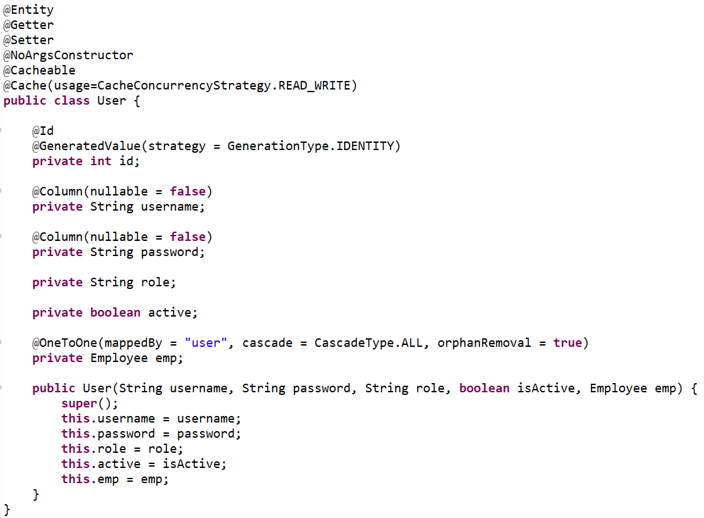

- let’s create Address.java
>- The same cache annotations on top

>- EmbeddedId: Here we are using a composite primary key, which the attributes are defined in a separate entity called AddressId.   Any attributes inside EmbeddedId will be inserted into the same table as Address

>- The ManyToOne, which we are using lazy load.  This means that when address is loaded, employee will not be loaded by default until someone called Addresses.getEmployee

>> 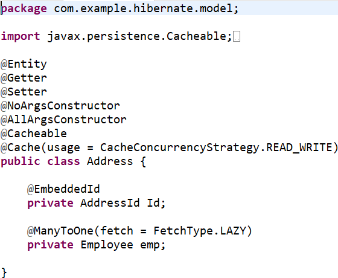

- Let’s create AddressId.java
>- To tell spring that this is a embeddable id on the inverse side, you put @Embeddable

>- Any composite key requires implementing Serializable, since when you load Address, you have to make all referenced objects serializable, i.e., allow these objects to decompose into bytes for effective transfer. 

>> 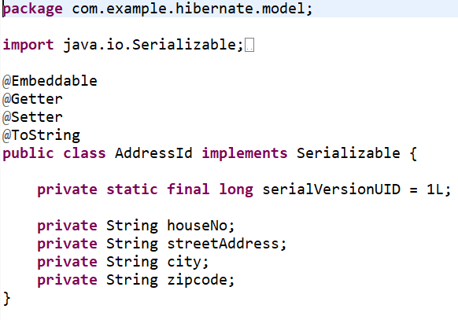

-Let’s create Leave.java, which is a parent of SickLeave.java and AnnualLeave.java.  This will help implement inheritance strategy
>- @Inheritance using Single_Table strategy, which means that any child attributes shall be put into a single table along with the parent attributes.  Make sure you have only one @Id only at the parent side

>- @DiscriminatorColumn which defines the name of the table column which helps discriminate between childs.  

>- I have included a column called LeaveType, which has the same column name as the discriminator name.  This is to tell hibernate that they are the same column.  This allows us to make sure our enum LeaveType is consistent with our discriminator column, instead of letting hibernate create its own discriminator value

>- Since LeaveType can only be specified by child (i.e., SickLeave or AnnualLeave), we need to set insertable and updatable to false

>- Since we are using LocalDate, we have to create a LocalDate converter.

>- @Enumerated(String) helps convert enum to String based on name

>> 

- Let’s implement SickLeave.java
>- @DiscriminatorValue is used to set the value of the column when this entity is created.  By default, it uses the class name

>> 

- Next Implement AnnualLeave.java

>> 

- Now create LeaveType.java
>- I have created a constructor for this enum, which helps convert enum to String, since DiscriminatorValue only accepts String

>> 

- Create Benefit.java model
>- it’s a ManyToMany relationship, using Set is much better

>- the mappedBy is here, it means we inform hibernate that Employee will be the owning side, and thus the resulting intermediate table will be EMPLOYEE_BENEFITS instead of BENEFITS_EMPLOYEE (trivial for those who want to know)

>- by default, ToMany side will be lazy load, we do not have to specify any lazy initialization

>> 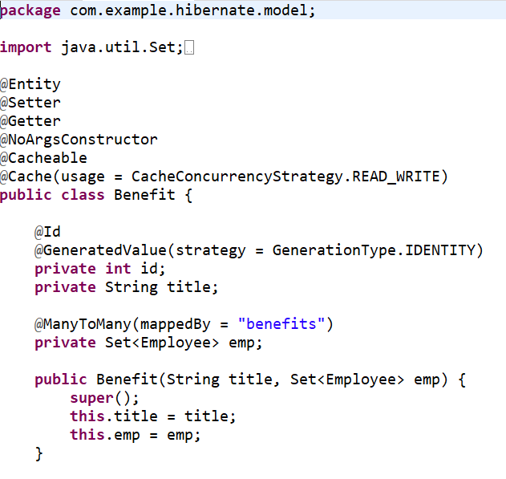

- let’s make the Name.java.  To make employee name elegant, we shall create an @Embeddable Name, containing fname, lname, and mname

>> 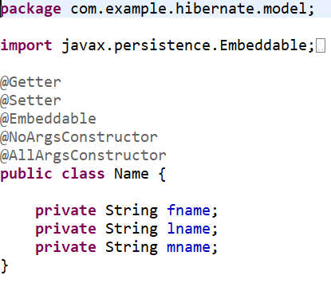

- Now create the Employee.java class
>- @Table allows us to explicitly specify the name we want.  By default, it uses the class name

>- @MapsId allows us to use the same id as User.  Since we are going to use the same id as User.java, we will not include GeneratedValue in the id field

>- @Column allows us to explicitly specify the column name

>- By default, ehcache does not cache collections, thus in ToMany associations, we have to explicitly specify the @cache

>- @JsonIgnore helps in infinite recursion.  For more details, refer to (https://www.baeldung.com/jackson-bidirectional-relationships-and-infinite-recursion)

>- @Transient demonstrates attributes that does not require mapping to the database

>> 

Create Repositories 

- First create EmployeeRepo.java

>> 

- Create LeaveRepo.java 

>> 

- Create UserRepo.java

>> 

Create Converters 

- LocalDateConverter.java to convert the date to local date format

>> 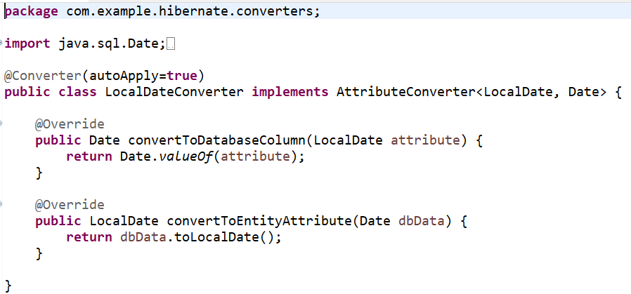

Create Controller

- Create the EmpployeeController.java for the employee model 

>> 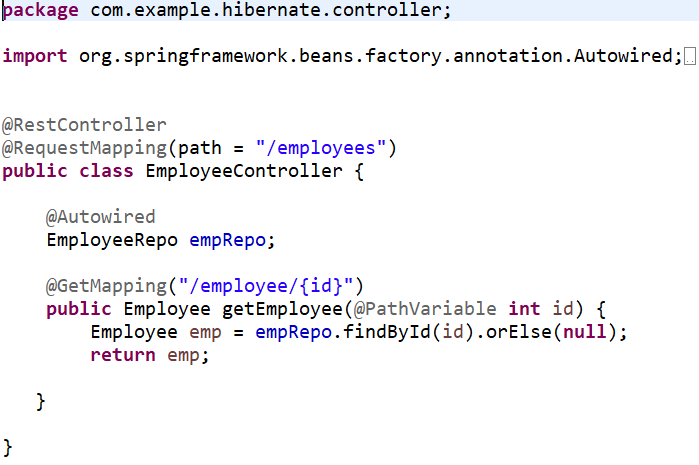

Create Security package 

- Create file SecurityConfig.java

>> 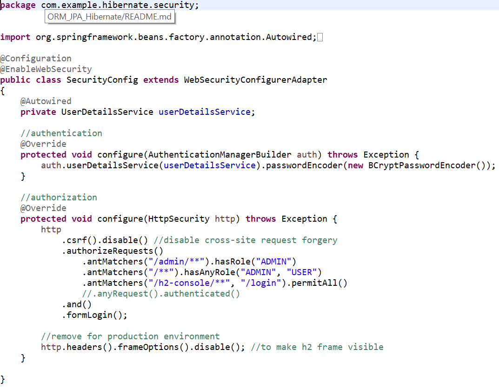

- Also create MyUserDetailsService.java

>> 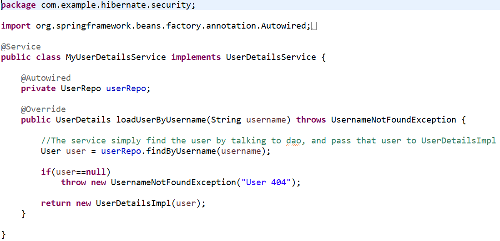

- Last create UserDetailsImpl.java

>> 

Create tests file inside service package

- TestService.java

>> 

>> 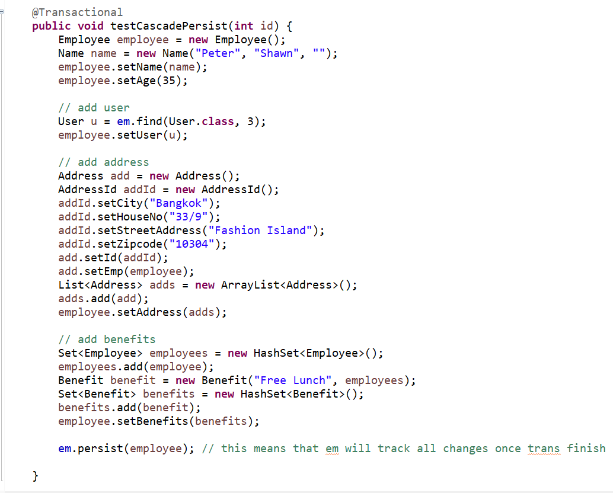

>> 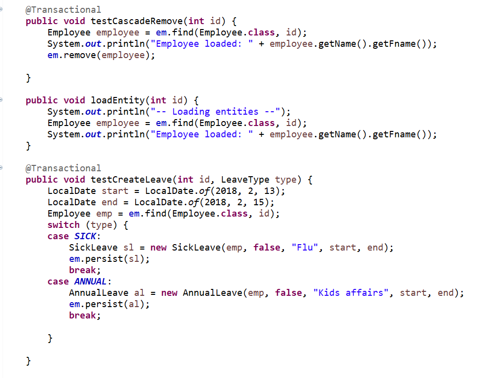

Update the application.java to execute the test service.

>> 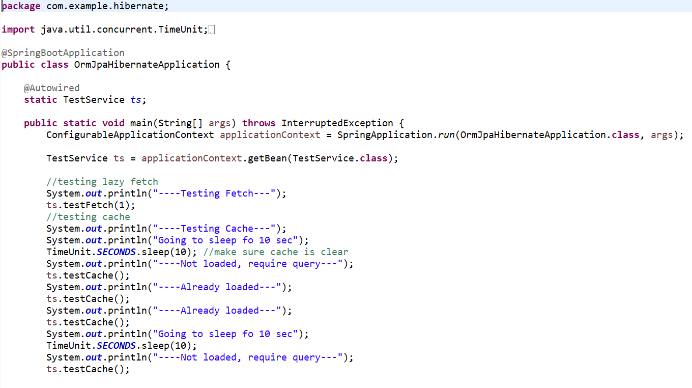

>> 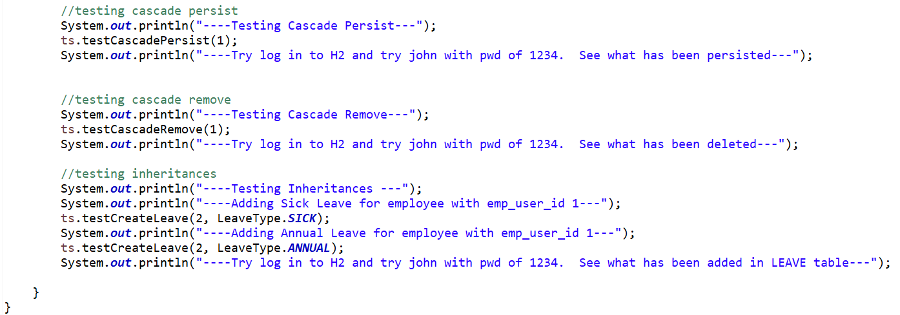
 
 
